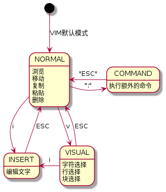

# VIM 基础操作

## 四种模式

VIM 是通过在四种模式之间的切换完成文件的浏览，移动，选定，编辑等操作。

VIM 的最基本操作流程：

- 打开：默认情况下 VIM 开启后，处于 NORMAL 模式
- 编辑：`i`切换至 INSERT 模式，输入文字。
- 保存：`ESC`切换至 NORMAL。`:`切换至 COMMAND 模式，输入`wq`+`enter` 完成保存，并退出。

| mode                | usage                                                          |
| ------------------- | -------------------------------------------------------------- |
| 正常模式(NORMAL)    | 浏览文件。可以执行，移动，复制，粘贴，删除等操作               |
| 插入模式(INSERT)    | 编辑文件。                                                     |
| 可视模式(VISUAL)    | 可视模式，可以进行行选定，块选定等操作                         |
| 命令行模式(COMMAND) | 命令行模式用于执行额外的命令，例如查找，替换，保存，退出等操作 |

- **NORMAL**

  NORMAL 模式是 VIM 的默认模式，可以进行复制，粘贴，删除，移动，翻页，查找等操作。 在任何模式下都可以通过`ESC`键回到 NORMAL 模式。

  _TIPS_：不知道处于什么模式就多按几次`ESC`,回到 NORMAL.

- **INSERT**

  在 NORMAL 模式下，可以通过`i`,`a`,`o`,`I`,`A`,`O`等按键，切换至插入模式，可以进行文本输入； 按`ESC`键回到 NORMAL 模式。

- **VISUAL**

  在正常模式下，可以通过`v`, `V`, `<C-v>`, 切换到 VISUAL，进行文字的选择:

  - `v`: 按 char 为单位进行选择
  - `V`: 以行尾单位进行选择
  - `<C-v>`: 块选择

- **COMMAND**

  命令行模式用于执行额外的命令。在正常模式下键入冒号（:）即可进入该模式；常用的命令如：

  | KEY             | 操作                                    | 说明                                      |
  | --------------- | --------------------------------------- | ----------------------------------------- |
  | `:e`            | 打开文件                                |                                           |
  | `:w`            | 保存                                    |                                           |
  | `:q`            | 退出                                    |                                           |
  | `:wq`           | 保存并退出                              |                                           |
  | `:q!`           | 强制退出                                |                                           |
  | `:%s/abc/def/g` | 全局替换 abc 成 def                     |                                           |
  | `:set number`   | 显示行号                                |                                           |
  | `:set number!`  | 关闭行号显示                            |                                           |
  | `:!ls`          | 执行系统 `ls`命令                       | `!`以叹号前缀代表后面要执行的是系统命令。 |
  | `:r!ls`         | 执行系统 `ls`命令，并将结果写入当前文件 | `r` 读取系统命令的回显，保存到当前文件    |

### 模式切换

| KEY     | 目标模式        | 说明                      |
| ------- | --------------- | ------------------------- |
| `i`     | INSERT          | `char`前 插入             |
| `I`     | INSERT          | `行首` 插入               |
| `a`     | INSERT          | `char`后 插入             |
| `A`     | INSERT          | `行末` 插入               |
| `o`     | INSERT          | `行下` 插入，新增行       |
| `O`     | INSERT          | `行上` 插入，新增行       |
| `R`     | INSERT(Replace) | 向后覆盖                  |
| `c` `w` | INSERT          | 删除当前词，并进入 INSERT |
| `v`     | VISUAL          | 以 char 为单位进行选择。  |
| `V`     | VISUAL          | 以行为单位进行选择        |
| `<C-v>` | VISUAL          | 块模式选择                |

**NOTE**: `:wq`以冒号开头代表在 COMMAND 模式输入；`<C-v>`代表组合按键 `CTRL+v`同时按下；`d` `d`代表连续两次`d`按键，以此类推，下同

## MOTION(移动光标）

在 NORMAL 和 VISUAL 模式下，可以通过借助快捷键，进行光标的快速跳转

| KEY        | 操作                  | 说明                                        |
| ---------- | --------------------- | ------------------------------------------- |
| `h`        | 左                    |                                             |
| `j`        | 下                    |                                             |
| `k`        | 上                    |                                             |
| `l`        | 右                    |                                             |
| `0`        | 行首                  | 数字 0                                      |
| `^`        | 行首                  | 当前行第一个有意义的 char                   |
| `$`        | 行末                  |                                             |
| `g` `_`    | 行末                  | 当期行最后一个有意义的 char                 |
| `g` `g`    | 页首                  | 第一行                                      |
| `G`        | 页尾                  | 最后一行                                    |
| `<C-o>`    | Older Cursor position | 光标的跳转轨迹,旧的位置                     |
| `<C-i>`    | Newer Cursor position | 光标的跳转轨迹,新的位置                     |
| `w`        | 下一个词头            |                                             |
| `W`        | 下一个词头            | 以空格分词                                  |
| `e`        | 下一个词尾            |                                             |
| `E`        | 下一个词尾            | 以空格分词                                  |
| `b`        | 上一个词头            |                                             |
| `B`        | 上一个词头            | 以空格分词                                  |
| `(`        | 句首                  |                                             |
| `)`        | 句尾                  |                                             |
| `:` `行号` | 跳转到指定行          |                                             |
| `%`        | 匹配括号              | 匹配当前光标所在的(),[],{}                  |
| `*`        | 向后匹配光标所在词    |                                             |
| `#`        | 向前匹配光标所在词    |                                             |
| `f` `char` | 行内向后查找 char     | `;`继续匹配,`,`反向继续匹配                 |
| `F` `char` | 行内向前查找 char     | `;`继续匹配,`,`反向继续匹配                 |
| `t` `char` | 行内向后查找 char     | 与 f 类似，光标移动到配项前的一个 char 位置 |
| `T` `char` | 行内向前查找 char     | 与 f 类似，光标移动到配项后的一个 char 位置 |
| `;`        | 继续匹配              | 结合`f` `t` `F` `T`使用                     |
| `,`        | 继续反向匹配          | 结合`f`,`t`,`F`,`T`使用                     |
| `/` `word` | 向后查找 word         | 通过`n`或者`N`继续向前或者向后查找匹配项    |
| `?` `word` | 向前查找 word         | 通过`n`或者`N`继续向前或者向后查找匹配项    |
| `<C-u>`    | 向上翻半页            |                                             |
| `<C-d>`    | 向下翻半页            |                                             |

## SELECTION(对象选择)

文本对象选择，只能在 VISUAL 模式下使用.

或者配合ACTION使用，用于选定ACTION要操作的对象，如：`das`，`d`代表动作删除，`as`选择整句话，组合起来就是删除光标所在的句子。

参考如下常用组合，具体内容可以通过在 COMMAND 模式中输入`help object-selection`查看所有组合。

| KEY     | 操作                       | 说明 |
| ------- | -------------------------- | ---- |
| `i` `>` | 选择 < > 不包括<>本身      |      |
| `a` `>` | 选择 < >,包括<>本身        |      |
| `i` `)` | 选择 ()                    |      |
| `a` `)` | 选择 () ,包括()本身        |      |
| `i` `w` | 选择 word 到当前词尾       |      |
| `a` `w` | 选择 word 到下一个词首     |      |
| `i` `s` | 选择 sentence 到当前句尾   |      |
| `a` `S` | 选择 sentence 到下一个句首 |      |

## ACTION(复制粘贴删除)

删除，剪切，复制等操作会将内容暂时存在"unamed register"中，相当于 windows 的剪贴板。关于 register 的概念，会在后续介绍，此处就当剪贴板理解就好。

| KEY     | 操作           | 说明 |
| ------- | -------------- | ---- |
| `d` `d` | 删除光标所在行 |      |
| `D`     | 向后删除到行末 |      |
| `x`     | 向后删除`char` |      |
| `X`     | 向前删除`char` |      |
| `y` `y` | 复制光标所在行 |      |
| `Y`     | 向后复制到行末 |      |
| `p`     | 向前粘贴       |      |
| `P`     | 向前粘贴       |      |

## 文件操作

| KEY                 | 操作                                  | 说明 |
| ------------------- | ------------------------------------- | ---- |
| `:e file_path`      | 打开文件                              |      |
| `:w`                | 保存文件                              |      |
| `:saveas file_path` | 另存文件                              |      |
| `:q`                | 退出 VIM                              |      |
| `:q!`               | 强制退出                              |      |
| `:qa!`              | 强制退出                              |      |
| `:wq!`              | 保存并强制退出                        |      |
| `:x`                | 保存并退出                            |      |
| `:e file_path`      | 打开文件                              |      |
| `:buffers`          | 查看打开的文件                        |      |
| `:bd`               | 关闭当前文件                          |      |
| `:bn` `:bp`         | 在 buffers list 中切换，next/previous |      |

# To be continued

## 常用操作&解释

## VIMRC

## Buffers

## Registers

## Split 

## Tab->Window->buffer

<!-- .(小数点) 可以重复上一次的命令 -->

<!-- N<命令> 重复某个命令 N 次 -->

<!-- dd 删除当前行并把删除的内容保存到剪贴板 -->

<!-- 2dd 重复 dd 命令 2 次，即删除两行并把删除的内容保存到剪贴板 -->

<!-- 5p 重复粘贴文本 5 次 -->

<!-- <开始位置><命令><结束位置> -->

<!-- 0y$:0 表示回到行首 -->

<!-- y 表示从这里开始复制 -->

<!-- $(拷贝)到本行最后一个 char -->

<!-- ye: 从当前 char 拷贝到单词的最后一个 char -->

<!-- 还有很多时候并不一定要按 y 来拷贝，下面的命令也会被拷贝 -->

<!-- d(删除) V(可视化的选择) gU gu -->

<!-- 在当前行上移动光标：0、^、$、f、F、t、T、，、; -->

<!-- 3fa 在当前行查找第三个出现的 a -->

<!-- ## Buffers -->

<!-- ## 分屏 -->

<!-- ## VIMRC -->

<!-- 打开一个 VIM 文件 -->

<!-- vim file1 -->

<!-- 打开 n 个 vim 文件 -->

<!-- vim file1 file2 file3 ... filen -->

<!-- 打开后默认显示 file1,切换方式，在正常模式输入：ls -->

<!-- 行操作 -->

<!-- 词操作 -->

<!-- dw 删除一个词，删除时要将光标移动到这个词的词首，如果光标不在一个词的词首，则删除所在单词的光标后的字母。 -->

<!-- yw 复制一个词 -->

<!-- w 切换单词 -->

<!-- 块操作 -->

<!-- D 或 d+$ 删除至行尾 d+^ 删除至行首 -->

<!-- y+$ 复制至行尾 y+^ 复制至行首 -->

<!-- V 模式 -->

<!-- 进入 V 模式后，移动光标可以选择区域 -->

<!-- 以多行注释为例： -->

<!-- 1. ctrl+v 进入到列块编辑模式 -->

<!-- 1. 向上或向下移动光标选择需要注释的行 -->

<!-- 1. shift+I 并输入# -->

<!-- 1. 按 ESC 键，你所选择的区域在行首就被添加了#注释符，且退回到命令模式。 -->

<!-- 删除多行注释 -->

<!-- 1. ctrl+v 进入列编辑模式。 -->

<!-- 1. 向上或向下移动光标选择需要取消的注释 -->

<!-- 1. 按 d 就会删除选中的注释符号。 -->

<!-- 改光标所在的一个 char 用 :r -->

<!-- :set nu 这个命令可以显示行号 -->
<!-- G 光标移动到最后一行 -->

<!-- 斜杠/正向查找 :/target n 往下查找 N 往上查找 -->

<!-- :noh 取消高亮显示 -->

<!-- :!ifconfig 调用系统命令 -->

<!-- vim 中定位到某行 -->

<!-- gg 定位到行首 -->

<!-- G 定位到最后一行行首 -->

<!-- 6G 定位到第 6 行 -->

<!-- :6 定位到第 6 行 -->

<!-- 6gg 定位到第 6 行 -->

<!-- 读取其他文件 -->

<!-- :r /etc/ssh/sshd_config.bak 读取/etc/ssh/sshd_config.bak 文件 -->

<!-- vim 打开多个文件 -->

<!-- vim -o /etc/passwd /etc/hosts 同时打开 passwd 和 hosts，小写 o 上下分屏 -->

<!-- vim -O /etc/passwd /etc/hosts 同时打开 passwd 和 hosts，大写 O 左右分屏 -->

<!-- ctrl+ww 在文件之间切换 -->
